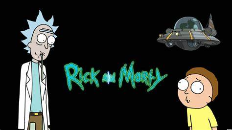
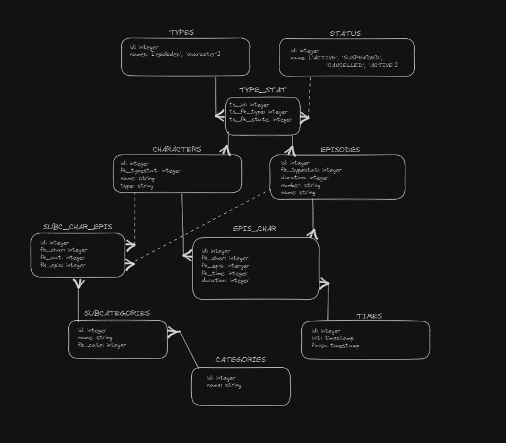

# Rick & Morty Service

Api de rick and morty desarrollado con NestJs con Prisma ORM.

## Database and relationship

**TYPES:** Tabla para almacenar los tipos de estatus.  
**STATUS:** Tabla para almacenar los estatus.  
**TYPE_STAT:** Tabla de relación entre tipos y estatus.  
**CHARACTERS:** Tabla para almacenar los personajes con una relación a TYPE_STAT.  
**EPISODES:** Tabla para almacenar los episodios con una relación a TYPE_STAT.  
**CATEGORIES:** Tabla para almacenar las categorías.  
**SUBCATEGORIES:** Tabla para almacenar las subcategorías con una relación a CATEGORIES.  
**EPIS_CHAR:** Tabla de relación entre personajes, episodios y tiempos.  
**SUBC_CHAR_EPIS:** Tabla de relación entre personajes, subcategorías y episodios.  
**TIMES:** Tabla para almacenar los tiempos de inicio y finalización de la participación de los personajes en los episodios.

### Bosquejo del modelo de ER



## Tech Stack

⚒️ NextJS | Prisma ORM

🔮 PostgresSql

💚 Node v21.2.0

## Despligue

### Docker

```bash

# Contruye la imagen de docker se ejecuta en localhost:3000
docker-compose up --build


```

### Local

```bash
# Instalación de paquetes
npm install

# Ejecución de la aplicación
npm run start:dev
```

## Data

El Script de la base de datos poblada se encuentra en la raiz del proyecto (inserts.sql)
El archivo seed.ts realiza los inserts en la base de datos

## Endpoints

La especificacion de los endpoints se construyo con swagger el cual al ejecutar el proyecto se puede ver en el siguiente enlace: http://localhost:3000/api
